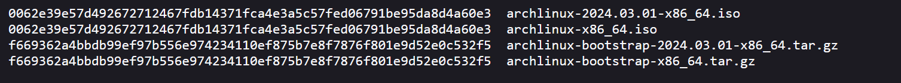

# A08:2021 – Software- und Datenintegritätsfehler

## Überblick

Wenn ein Benutzer eine Software oder Daten herunterlädt, muss sichergestellt werden, dass diese, nachdem sie vom Server gesendet wurden und beim Client ankommen, nicht manipuliert wurden. Man stelle sich vor was für ein Schaden angerichtet werden könnte, wenn ein Betriebssystem, welches ein wichtiges Unternehmen installiert, eine von Hackern manipulierte Version ist. Zudem sollen Daten, welche über das Internet übertragen werden, nicht manipuliert werden können. Empfängt ein Benutzer zum Beispiel eine modifizierte Nachricht, kann damit ebenfalls Schaden angerichtet werden.

## Erläuterung zu Aufgabe 3 und 4

### Aufgabe 3

CWE – Common Weakness Enumeration. CWE & OWASP Top 10 hängen damit zusammen, dass beide eine Art Auflistung der häufigsten Sicherheitslücken sind.

CWE ist eine Auflistung von Sicherheitsschwachstellen, die in Software, Hardware und Firmware auftreten können. CWE ist gut dafür geeignet standardisierte Methoden für die Kategorisierung und Beschreibung der Schwachstellen, dies hilft dabei diese besser zu kommunizieren und zu verstehen.

### Aufgabe 4

OWASP Top 10 Risk sind die häufigsten Risiken und OWASP Proactive Controls ist die Auflistung von möglichen Massnahmen welche Risiken von Anfang an hemmen oder beseitigen sollen.

## Theoretische Hintergründe

### Softwareintegrität

Um die Integrität einer Software zu gewähren, kann ein Checksum verwendet werden. Diese Checksumme wird bei der Installation der Software berechnet und mit der Checksumme des Herstellers verglichen. So kann sichergestellt werden, dass die Software nicht manipuliert wurde.

### Datenintegrität

Um die Integrität von Daten zu gewährleisten, kann eine Verschlüsselung verwendet werden. So kann sichergestellt werden, dass die Daten nicht manipuliert wurden. Zudem können die Daten nur von Personen gelesen werden, welche über den Private Key verfügen.

## Massnahmen mit Codebeispiel

### Softwareintegrität

#### Beispiel in Node.js App

Dies wird, wenn ein Package zu einer App hinzugefügt wird von npm automatisch gemacht. Wird dann `npm install` ausgeführt wird die Checksumme des Herstellers mit dem von npm heruntergeladenen Package verglichen.

```json
"packages":{
    "node_modules/@esbuild/win32-arm64"{
        "version": "0.18.20",
        "resolved": "https://registry.npmjs.org/@esbuild/win32-arm64/-/win32-arm64-0.18.20.tgz",
        "integrity": "sha512-checksum"
    }
}
```

#### Beispiel Arch Installation

1. Möchte ich mir Arch linux installieren, kann ich die Installationsdatei aus dem Internet herunterladen. [Website](https://mirror.metanet.ch/archlinux/iso/2024.03.01/)
2. Habe ich die Datei auf meinem lokalen Rechner, kann ich den folgenden Befehl ausführen, welcher mir den Hash berechnet:

```powershell
certutil -hashfile "archlinux-2024.03.01-x86_64.iso" sha256 # -> 0062e39e57d492672712467fdb14371fca4e3a5c57fed06791be95da8d4a60e3
```

3. Diesen Hash kann ich nun mit dem auf der Herstellerseite angegebenen vergleichen. [Link Checksums](https://mirror.metanet.ch/archlinux/iso/2024.03.01/sha256sums.txt)

4. Die beiden Werte stimmen überein und ich kann sicher sein, dass sie zwischen Server und mir nicht verändert wurden.

### Datenintegrität

#### Beispiel Json

Eine Textnachricht, in diesem Beispiel ein JSON-Objekt, kann verschlüsselt werden, um die Integrität zu gewährleisten. So kann sichergestellt werden, dass die Nachricht nicht manipuliert wurde, das sie sonst nicht mehr entschlüsselt werden könnte.

```json
{
  "name": "John",
  "age": 30,
  "city": "New York"
}
```

Verschlüsselt man diese Nachricht mit der PGP-Verschlüsslung und irgendeinem Public Key sieht sie wie folgt aus:

```
-----BEGIN PGP MESSAGE-----
Version: OpenPGP.js v4.10.10
Comment: https://openpgpjs.org

wYwDEUUqBfsDqSgBA/47Wz7B/S1kudDDm0S+dISA2DW6aLHT/R1DJzRWerox
UB09V9STQs9AQQ8DCuM7LrrR3m7pB3E4TpR0W5KYj2BO9Qq7pCA4nvN2fa3V
V9FHBgFZjQQcIkeuvWUbCbMdCNhaMH8qISrF923T+2pc9bBaWrgepfcerHzd
RNKuyORkqNJzAdtMQjg2qYFLAqv4tA1GwZG2tW0U22Fd5KtW4QwQDYY6hEDa
SKWl9Qm5VouY9UA3OdjJlhJemhWneOcrtaDJBICkZWJNo9nds9v7jyYPky1y
q/xrYN721wWiLgPPd+g2H/UjKScbVmHsSt4H6PD2Ei6GxA==
=afYX
-----END PGP MESSAGE-----
```

Dies kann zum Beispiel mit der Software [Kleopatra](https://www.openpgp.org/software/kleopatra/) gemacht werden.

Diese Nachricht kann nur von einer Person gelesen werden welche über den Private Key verfügt. Heisst sie kann inhaltlich nicht verändert werden, so kann die Integrität sichergestellt werden.

## Resultate, Erkenntnisse

Es mach einfacher sein die Daten und Nachrichten unverschlüsselt hin und her zu schicken. Dies ist jedoch keine gute Idee denn leider gibt es Menschen, welche das ausnutzen würden. Mit den aufgezeigten Methoden kann die Daten- und Softwareintegrität sichergestellt werden und man muss nicht mehr befürchten dass jemand zwischen Client und Server seine Finger im Spiel hat. Leider ist dies nur ein kleiner Faktor um sicher mit dem Internet zu interagieren.

## Quellen

- [Owasp Top 10 - A08 Software and Data Integrity Failures](https://owasp.org/Top10/A08_2021-Software_and_Data_Integrity_Failures/)
